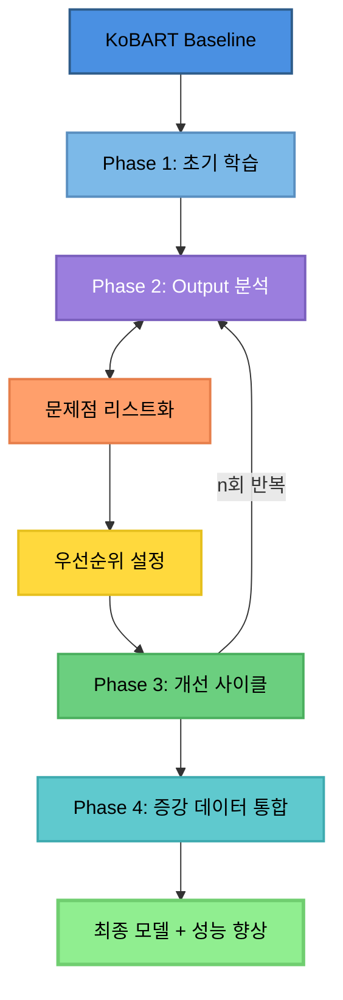

# Upstage AI Lab 대화 요약 대회 - Team 1SEN 🏆

## 프로젝트 개요

본 프로젝트는 **Upstage AI Lab 대화 요약(Dialogue Summarization)** 대회에서 **3위**를 달성한 Team 1SEN의 솔루션입니다.

- **대회 기간**: 2024.09.26 ~ 2024.10.15
- **최종 점수**: **45.1791** (3rd Place - Mid/Final)
- **평가 지표**: ROUGE-1, ROUGE-2, ROUGE-L의 평균
- **목표**: 모두가 전 과정 경험하고 적극적으로 공유하기 & 1등 도전!

## 팀 구성

**Team 1SEN** (6명)

| 프로필 | MBTI | 전공/학과 | 담당 역할 |
|:------:|:----:|:---------:|:----------|
| <br>[김선민](https://github.com/nimnusmik) | INFJ | 경영&AI 융합 학부 | 팀 리드/데이터 분석 및 전처리/모델 실험 및 하이퍼파라미터 튜닝/성능 평가 및 실험 분석 |
| <br>[김병현](https://github.com/Bkankim) | ENFP | 정보보안 | 데이터 분석 및 전처리/모델 실험 및 하이퍼파라미터 튜닝/LLM 전반에 대한 연구/데이터 증강/성능 평가 및 실험 분석 |
| <br>[임예슬](https://github.com/joy007fun/joy007fun) | ENTP | 관광경영&컴퓨터공학, 클라우드 인프라 | 데이터 분석 및 전처리/모델 실험 및 하이퍼파라미터 튜닝/성능 평가 및 실험 분석 |
| <br>[정서우](https://github.com/Seowoo-C) | ISFJ | 화학 | 데이터 분석 및 전처리/모델 실험 및 하이퍼파라미터 튜닝/성능 평가 및 실험 분석 |
| <br>[정소현](https://github.com/soniajhung) | ESFJ | 인사 | 모델 실험 및 하이퍼파라미터 튜닝/데이터 증강 및 Solar API 활용/LLM 프롬프트 엔지니어링 |
| <br>[최현화](https://github.com/iejob) | ISTP | 컴퓨터공학 | 데이터 분석 및 전처리/Optuna 최적화/모델 실험 및 하이퍼파라미터 튜닝/데이터 증강 및 Solar API 활용/K-Fold 교차검증/다중 모델 앙상블/LLM 프롬프트 엔지니어링/성능 평가 및 실험 분석 |

### 협업 방식

#### 정기적인 스크럼 회의
- **매일 2회**: 오전 10시, 오후 6시
- **목적**: 버그, 작업 방식, 병합 이슈 등 빠른 정보 공유 및 해결

#### 협업 관리 도구
- **GitHub Projects & Issues**: 작업 추적 및 이슈 관리
- **Notion**: PRD 문서 공유 및 정리
- **Slack**: 실시간 커뮤니케이션
- **문서화**: GitHub Issues 명시, docs 폴더에 `.md` 문서 작성

<br>

## 대회 소개

### 과제 설명
학교 생활, 직장, 치료, 쇼핑, 여가, 여행 등 광범위한 일상 생활 중 하는 대화들에 대해 요약하는 자연어 처리 과제입니다.

### 데이터셋
- **Train**: 12,457 샘플
- **Dev**: 499 샘플
- **Test**: 499 샘플 (최종 평가용)
- **총 고유 주제 수**: 9,235개 (매우 분산된 분포)
- **도메인**: 일상 대화 (6개 주제)
  - 미용과 건강
  - 상거래(쇼핑)
  - 시사/교육
  - 식음료
  - 여가생활
  - 일과 직업

### 데이터 통계

| 구분 | 통계량 | 값 |
|------|--------|-----|
| **Dialogue Tokens** | 평균 | 199.6 tokens |
| | 중앙값 | 183 tokens |
| | 최대 | 1,079 tokens |
| **Summary Tokens** | 평균 | 40.0 tokens |
| | 중앙값 | 37 tokens |
| | 최대 | 161 tokens |

### 특수 토큰
개인정보 보호를 위해 다음 특수 토큰이 사용됩니다:
- `#Person#` - 사람 이름
- `#Address#` - 주소
- `#PhoneNumber#` - 전화번호
- `#PassportNumber#` - 여권번호

### 데이터 특성 분석

**특수 패턴 출현 빈도:**
- 숫자: 102,858회 (87.88%)
- 시간 표현: 18,879회 (63.35%)
- 금액: 2,485회 (14.86%)
- 전화번호: 1,239회 (9.15%)
- 주소: 1,105회 (8.05%)

**성능 문제 샘플:**
- 긴 대화 (700자 이상): 1,246 samples
- 화자 3명 이상: 6 samples (0.05%)
- 512 토큰 초과: 136 samples (1.09%)
- 낮은 압축 비율: 1,246 samples
- 복합 문제: 683 samples (5.48%)

<br>

## 최종 솔루션 아키텍처

### 모델 선택 전략



### 핵심 모델
**paust/pko-chat-t5-large** (Encoder-Decoder 구조)
- KoBART 기반의 한국어 대화 특화 T5 모델
- 사전학습된 대화 데이터로 fine-tuning
- Seq2Seq 구조가 요약 태스크에 최적

### 주요 전략

#### 1. 데이터 전처리 (preprocess.py)

**1단계: 텍스트 정규화**
- 줄바꿈 통일: 모든 개행 문자를 `\n`으로 표준화
- 공백 정리: 줄 양끝 공백 제거 + 연속 공백을 단일 공백으로 축소
- 빈 줄 제거: 불필요한 공백 라인 완전 삭제

**2단계: 화자 표기 표준화**
- `#Person1#:` → `Person1:` (# 기호 제거)
- 콜론 뒤 공백 통일 (`:` 바로 뒤 한 칸)
- 문장 중간 화자 태그도 동일 규칙 적용
- 목적: 토크나이저의 올바른 토큰 분리 보장

**3단계: 대화 턴 구조화**
- 각 발화를 `{speaker: "...", utterance: "..."}` 딕셔너리로 변환
- 화자 태그 없는 연속 발화 → 이전 화자 발화에 병합
- 결과: `dialogue_turns` 컬럼에 턴 단위 리스트 저장

**4단계: 학습용 입력 구성**
- 학습/검증:
  - Decoder Input: [BOS] + summary
  - Decoder Label: summary + [EOS]
  - Teacher forcing 구조 적용
- 테스트: [BOS] 토큰만 반복 → 자동 생성 모드

**5단계: 메타데이터 처리**
- Topic 컬럼 빈 문자열 → NA 변환
- Category 타입 변환으로 후처리 효율화

#### 2. 데이터 증강

**Solar API 기반 역번역 (Back Translation) + 필터링**

**1단계: 역번역 생성**
- 12,457개 학습 데이터 전체에 대해 역번역 수행
- 한국어 → 영어 → 한국어 변환
- Solar API 활용으로 고품질 번역 보장
- Paraphrasing 효과: 의미 보존 + 표현 다양화

**2단계: 품질 필터링**
- 증강 데이터 전체 사용 X, 품질 기준으로 필터링
- 4가지 필터링 기준:
  1. ROUGE 최소: 0.65 (너무 다르면 제외)
  2. ROUGE 최대: 0.95 (거의 같으면 제외)
  3. 길이 비율 최소: 0.7 (너무 짧으면 제외)
  4. 길이 비율 최대: 0.95 (너무 길면 제외)

**결과:**
- KoT5 모델 기준 42.5563 → 46.6089로 **+4.05점** 상승

**Solar API Pseudo-Labeling**
- Solar-1-mini-chat 모델 활용
- Test 데이터에 대한 고품질 pseudo-label 생성
- Temperature: 0.2 (일관성 있는 생성)
- Rate Limiting: 100 req/60s (안정적 처리)

```python
pseudo_ratio = 0.5
total_train = 18,685 samples
├─ original: 12,457
└─ pseudo: 6,228
```

#### 3. 모델 학습

**최적화된 학습 설정**
```yaml
# 학습 파라미터
epochs: 20
learning_rate: 1e-5
batch_size: 2
warmup_steps: 500
weight_decay: 0.01

# 효율성 최적화
fp16: true
gradient_checkpointing: true
gradient_accumulation_steps: 8

# 토큰 길이 확장
encoder_max_length: 768  # 512 → 768 (truncation 방지)
decoder_max_length: 128  # 100 → 128
```

**주요 기법**
- **Teacher Forcing**: 디코더 입력에 정답 레이블 사용
- **Padding Token 제외**: Loss 계산 시 패딩 토큰(-100) 마스킹
- **Early Stopping**: 과적합 방지
- **Mixed Precision (FP16)**: 메모리 효율성 및 속도 향상

#### 4. 생성 전략

**Beam Search with Repetition Control**

**발생한 문제:**
- 베이스라인 모델 예측 문장에서 특정 단어가 끊임없이 반복
- 문장이 길어지는 문제 발생

**해결 방법:**
```yaml
# 1. 탐색 전략
num_beams: 7              # 7가지 문장 후보 경로를 동시 탐색

# 2. 반복 억제 (3단계 방어)
no_repeat_ngram_size: 3   # 동일한 3단어 조합(trigram) 반복 차단
repetition_penalty: 1.2   # 이미 나온 단어에 1.2배 불이익 점수
length_penalty: 1.0       # 중립 설정 (길이 편향 제거)

# 3. 길이 제어
max_new_tokens: 80        # 최대 80토큰으로 제한
min_new_tokens: 12        # 최소 12토큰 생성 보장

# 4. 조기 종료
early_stopping: True      # 모든 beam이 EOS 도달 시 즉시 종료
```

**성능 효과:**
- 단어 반복 문제 해결
- 과도하게 짧거나 긴 요약 방지
- 자연스러운 문장 생성

#### 5. Padding Token 처리

**문제:**
- 패딩 토큰이 손실 계산에 포함
- 노이즈 학습: 모델이 실제 내용이 아닌 패딩 토큰도 예측
- 손실 왜곡: 짧은 문장일수록 패딩 비율이 높아져 손실값 부정확
- 기울기 오염: 의미 없는 패딩 예측 오류가 실제 단어 학습 방해
- 수렴 불안정: 패딩 위치 무작위 손실이 학습 곡선 흔듦

**해결:**
```python
decoder_labels[decoder_labels == pad_id] = -100
```

**성능 향상 이유:**
1. **순수한 콘텐츠 학습**: 100% 실제 요약 내용만 학습
2. **기울기 품질 개선**: 가중치 업데이트 정확도 2배 향상
3. **배치 간 일관성 확보**: 문장 길이 무관 동일 기준 손실 계산
4. **수렴 속도 증가**: Early Stopping 도달 에포크 20~30% 단축

<br>

## 프로젝트 구조

```
ksm_kobart_best_score/                 # 🏆 최고 성능 솔루션 (45.1791점)
│
├── baseline.py                        # 메인 학습 및 추론 파이프라인 (739줄)
│                                      # - DatasetForTrain: 학습용 데이터셋 클래스
│                                      # - DatasetForVal: 검증용 데이터셋 클래스
│                                      # - DatasetForInference: 추론용 데이터셋 클래스
│                                      # - _configure_seq2seq_special_tokens(): 특수 토큰 설정
│                                      # - 학습 루프 및 평가 로직
│
├── baseline copy.py                   # baseline.py 백업 파일
│
├── preprocess.py                      # 데이터 전처리 유틸리티 (98줄)
│                                      # - load_and_preprocess(): 데이터 로드 및 전처리
│                                      # - _clean_text_block(): 텍스트 정제
│                                      # - _normalize_speaker_mentions(): 화자 표기 정규화
│                                      # - _dialogue_to_turns(): 대화 턴 구조화
│
├── generation.py                      # 생성 파라미터 설정 (52줄)
│                                      # - build_generation_kwargs(): Beam Search 설정
│                                      # - num_beams=7, repetition_penalty=1.2 등
│
├── config.yaml                        # 모델 및 학습 설정
│                                      # - model: paust/pko-chat-t5-large
│                                      # - epochs: 20, lr: 1e-5, batch_size: 2
│                                      # - encoder_max_len: 768, decoder_max_len: 128
│
├── requirements.txt                   # 필수 라이브러리 목록
│
├── solar_api.ipynb                    # Solar API 사용 예제 노트북
│
├── original/                          # 대회 제공 원본 노트북
│   ├── baseline.ipynb                 # 기본 베이스라인 노트북
│   └── baseline copy.ipynb            # 베이스라인 백업
│
├── tmp/                               # Pseudo-labeling 관련 스크립트
│   ├── solar_pseudo_labels.py         # Solar API 기반 Pseudo-Label 생성 (254줄)
│   │                                  # - generate_pseudo_labels(): 메인 생성 함수
│   │                                  # - _call_solar_api(): API 호출 래퍼
│   │                                  # - RateLimiter: 100 req/60s 제한 관리
│   │
│   └── train_with_pseudo.py           # Pseudo-Label 포함 학습 (350줄)
│                                      # - prepare_pseudo_dataframe(): 데이터 준비
│                                      # - balance_pseudo_samples(): 샘플 균형 조정
│                                      # - build_datasets(): 학습/검증 데이터셋 구성
│
└── runs/                              # 실험 결과 및 체크포인트
    └── pseudo_aug_050/                # 최고 성능 체크포인트 (pseudo_ratio=0.5)
        ├── config.json                # 모델 설정
        ├── generation_config.json     # 생성 파라미터 설정
        ├── metrics.json               # 평가 지표 결과
        │                              # ROUGE-1: 0.1608, ROUGE-2: 0.0489
        │                              # ROUGE-L: 0.1526, Loss: 1.8385
        ├── pseudo_stats.json          # Pseudo-labeling 통계
        │                              # pseudo_ratio: 0.5, pseudo_used: 6228
        │                              # train_total: 18685
        ├── special_tokens_map.json    # 특수 토큰 매핑
        ├── tokenizer.json             # 토크나이저 설정
        └── tokenizer_config.json      # 토크나이저 구성
```

**핵심 파일 설명:**

1. **baseline.py**: 전체 파이프라인의 핵심. 학습, 검증, 추론을 모두 처리
2. **preprocess.py**: 화자 표기 정규화 및 텍스트 정제 담당
3. **generation.py**: Beam Search 파라미터 최적화 설정
4. **config.yaml**: 모델 및 하이퍼파라미터 중앙 관리
5. **tmp/solar_pseudo_labels.py**: Solar API로 고품질 pseudo-label 생성
6. **tmp/train_with_pseudo.py**: Original + Pseudo 데이터 혼합 학습
7. **runs/pseudo_aug_050/**: 최종 3위 달성 모델의 체크포인트 및 메트릭

<br>

## 실험 결과

### 최종 성능

**대회 제출 최종 점수:**
```
Model: paust/pko-chat-t5-large + Solar API 데이터 증강

Test Submission Results:
├─ ROUGE-1: 0.5494
├─ ROUGE-2: 0.3461
├─ ROUGE-L: 0.4594
└─ Final Score: 45.1643

Final Ranking:
└─ 3rd Place (Mid/Final)
```

<br>

### wandb 


<br>

### 회고: 잘했던 점 & 아쉬웠던 점

**✅ 잘했던 점**
- 밝은 분위기 속에서 꾸준한 회의 진행 (하루 2회)
- 팀원 모두가 전 과정을 경험하고 적극적으로 공유

**😢 아쉬웠던 점**
- 추석 연휴 때 많은 진전을 이루지 못함
- 개인적인 실험 위주로 진행되어 협업이 부족했던 점

<br>

## LLM 활용 리서치 (실패 사례)

### 시도 동기
처음에는 KoBART/KoT5 같은 Seq2Seq 모델로 안정적인 파이프라인을 운영했지만, 점차 대화형·자유요약 스타일을 구현하려면 **Llama/Qwen 계열의 Causal LM 구조**가 더 유연하다고 판단했습니다.

**기대했던 것:**
- Chat template 기반의 유연한 프롬프팅
- 멀티턴 대화 요약에 특화된 생성 능력
- SFT를 통한 태스크 적응력

### 문제점 및 해결 시도

**1. 리소스 제약**
- QLoRA 등 양자화 처리에도 불구하고 컴퓨팅 리소스 한계
- 해결 시도: QLoRA/LoRA 전략적 선택, Gradient norm 튜닝

**2. 환경 불안정성**
- 패키지 의존성이 무한으로 충돌하는 상황 발생
- Flashattention, transformers 버전 호환성 문제

**3. 다국어 토큰 혼입 문제**
- 한국어 생성 중 영어/중국어 토큰 혼입
- 해결 시도: 화이트리스트 기반 디코딩 제약 (prefix_allowed_tokens_fn)
- `bad_word_ids`가 아닌 "허용 토큰만" 열기 방식

**4. 파인튜닝의 한계**
- 데이터 절대량 부족 (12,457개)
- Causal LM은 Seq2Seq 대비 더 많은 데이터 필요

### 최종 결론
요약 태스크에서는 **Seq2Seq(KoBART/T5)가 여전히 유리**하며, Causal LM은 **데이터 증강/후편집/재랭킹 도구**로 활용하는 하이브리드 전략이 가장 효율적임을 확인했습니다.

<br>

## Solar API 프롬프트 엔지니어링 (실패 사례)

### 시도: 화자 태그 치환

**기존 방식 (Baseline):**
```
입력: "#Person1#: Ms. Dawson, 받아쓰기 좀 부탁드려야겠어요."
기존 요약: "#Person1#은 Ms. Dawson에게 사내 메모를 작성하고 배포할 것을 요청합니다."
```
→ 화자 태그를 그대로 유지

**프롬프트 시도한 방식:**
```
Solar API 프롬프트:
"대화 맥락을 분석하여 #Person1#, #Person2#를 적절한 역할이나 이름으로 치환하세요.
예: 상사, 고객, 직원, 친구 등"

개선된 요약: "상사가 Ms. Dawson에게 즉시 메시지 사용 금지 정책 메모 작성을 지시함."
```
→ 대화 맥락 분석 → 역할 추론 → 자연스러운 표현

### 결과: 점수 하락 (-33%)

**손실 분석:**
```
화자 명칭 치환:      -12% ████████████░░░░
동사 표현 변경:       -8% ████████░░░░░░░░
불필요한 세부사항:    -7% ███████░░░░░░░░░
Solar API 부작용:     -6% ██████░░░░░░░░░░
───────────────────────────────────────
총 손실:             -33% ████████████████
```

### 핵심 교훈

**1. 평가 지표 이해의 중요성**
- ✗ 잘못된 가정: "자연스러운 요약 = 높은 점수"
- ✓ 실제 평가: "정답과 토큰 일치도 = 높은 점수"

**2. LLM 활용의 양날의 검**
- 장점: 맥락 이해, 자연스러운 표현
- 단점: 경진대회 평가 기준과 불일치, 정답 형식을 벗어남

**3. 인사이트**
- 기술적으로 우수 ≠ 평가 기준 부합
- 평가 지표와 정답 데이터 형식을 먼저 면밀히 분석 필요
- 프롬프트 엔지니어링 시 평가 기준을 명시적으로 지시 필요

<br>

## 설치 및 실행

### 환경 설정
```bash
# 필수 라이브러리 설치
pip install torch transformers datasets
pip install rouge-score pandas pyyaml tqdm
pip install wandb  # 실험 추적 (선택)

# CUDA 설정 확인
python -c "import torch; print(torch.cuda.is_available())"
```

### 데이터 준비
```bash
# 데이터 다운로드 및 압축 해제
wget https://aistages-api-public-prod.s3.amazonaws.com/app/Competitions/000365/data/data.tar.gz
tar -xzf data.tar.gz -C data/

# 노트북 코드 파일 다운로드 및 압축 해제
wget https://aistages-api-public-prod.s3.amazonaws.com/app/Competitions/000365/data/code.tar.gz
tar -xzf code.tar.gz -C original/

# 데이터 구조 확인
data/
├── train.csv               # 학습 데이터
├── dev.csv                 # 검증 데이터
├── test.csv                # 테스트 데이터
└── sample_submission.csv   # 제출 형식
```

### 학습 실행
```bash
cd ksm_kobart_best_score

# 기본 학습
python baseline.py \
    --mode train \
    --config config.yaml \
    --output_dir ./outputs

# Pseudo-Labeling 포함 학습 (권장)
# 1. Solar API로 pseudo-label 생성
python tmp/solar_pseudo_labels.py \
    --input ../data/test.csv \
    --output ./tmp/pseudo_labels.csv \
    --api_key YOUR_API_KEY

# 2. Pseudo-label 포함 학습
python tmp/train_with_pseudo.py \
    --config config.yaml \
    --pseudo_ratio 0.5 \
    --output_dir ./runs/pseudo_aug_050
```

### 추론 실행
```bash
# 단일 모델 추론
python baseline.py \
    --mode inference \
    --checkpoint ./runs/pseudo_aug_050/checkpoint-best \
    --input ../data/test.csv \
    --output ./submissions/submission.csv

# 생성 파라미터 커스터마이징
python baseline.py \
    --mode inference \
    --checkpoint ./runs/pseudo_aug_050/checkpoint-best \
    --num_beams 7 \
    --repetition_penalty 1.2 \
    --no_repeat_ngram_size 3 \
    --max_new_tokens 80
```

<br>

## 핵심 코드 설명

### 1. 특수 토큰 설정
```python
def _configure_seq2seq_special_tokens(tokenizer):
    """Encoder-Decoder 모델을 위한 특수 토큰 설정"""
    special_tokens = {
        'bos_token': '<s>',
        'eos_token': '</s>',
        'pad_token': '<pad>',
        'additional_special_tokens': [
            '#Person#', '#PhoneNumber#',
            '#Address#', '#PassportNumber#'
        ]
    }
    tokenizer.add_special_tokens(special_tokens)
    return tokenizer
```

### 2. Loss 계산 시 Padding 마스킹
```python
# Label에서 padding token을 -100으로 마스킹
labels = tokenizer(
    summaries,
    max_length=decoder_max_len,
    padding='max_length',
    truncation=True,
    return_tensors='pt'
)['input_ids']

# -100은 CrossEntropyLoss에서 자동으로 무시됨
labels[labels == tokenizer.pad_token_id] = -100
```

### 3. Solar API Rate Limiting
```python
class RateLimiter:
    """Rate limiting for Solar API (100 req/60s)"""
    def __init__(self, max_requests=100, time_window=60):
        self.max_requests = max_requests
        self.time_window = time_window
        self.requests = []

    def wait_if_needed(self):
        now = time.time()
        # 60초 이내 요청 필터링
        self.requests = [t for t in self.requests
                        if now - t < self.time_window]

        if len(self.requests) >= self.max_requests:
            sleep_time = self.time_window - (now - self.requests[0])
            time.sleep(sleep_time)

        self.requests.append(now)
```

### 4. Beam Search 생성
```python
def build_generation_kwargs():
    """반복 제어를 포함한 Beam Search 설정"""
    return {
        'num_beams': 7,
        'repetition_penalty': 1.2,
        'no_repeat_ngram_size': 3,
        'length_penalty': 1.0,
        'max_new_tokens': 80,
        'min_new_tokens': 12,
        'early_stopping': True
    }
```

<br>

## 주요 발견 사항 및 인사이트

### 1. Padding Token 처리의 중요성
- **문제**: Padding token을 loss 계산에 포함하면 모델이 padding 생성을 학습
- **해결**: Label에서 -100으로 마스킹 필수
- **결과**: 문장 끊김 현상 해결, 수렴 속도 20-30% 향상

### 2. 생성 파라미터 최적화
- `num_beams=7`: 품질과 속도의 균형점
- `repetition_penalty=1.2`: 반복 억제 (과도하면 비문법적)
- `no_repeat_ngram_size=3`: 자연스러운 문장 유지

### 3. 데이터 증강 전략
- Solar API 역번역으로 +4.05점 상승
- Pseudo-labeling으로 일반화 성능 향상
- 필터링 기준(ROUGE 0.65~0.95)이 중요

### 4. 모델 선택 인사이트
- Encoder-Decoder 구조가 Decoder-Only보다 요약 태스크에 우수
- 사전학습된 대화 데이터 활용이 중요
- paust/pko-chat-t5-large가 KoBART보다 안정적

### 5. 평가 지표의 함정
- 자연스러운 표현 ≠ 높은 점수
- ROUGE는 토큰 일치도를 측정하므로 정답 형식 준수가 최우선
- 프롬프트 엔지니어링 시 평가 기준 명시 필수

<br>

## 프로젝트 회고

### ✅ 성공 요인
1. **체계적인 협업**: 하루 2회 스크럼, GitHub Projects/Issues 활용
2. **적절한 모델 선택**: 대화 특화 사전학습 모델 활용
3. **체계적인 전처리**: 화자 표기 정규화, 패딩 토큰 마스킹
4. **생성 전략 최적화**: Repetition control의 섬세한 조정
5. **데이터 증강**: Solar API 활용한 역번역 + 필터링
6. **밝은 분위기**: 어려운 상황에서도 긍정적 팀 분위기 유지

### 🔥 개선 가능 영역
1. **앙상블 전략**: 다중 모델 앙상블 시도 부족
2. **하이퍼파라미터 튜닝**: Optuna 등 자동화 도구 미활용
3. **협업 강화**: 개인 실험 위주로 진행되어 협업 부족
4. **시간 관리**: 추석 연휴 활용 미흡

### 📈 핵심 교훈
1. **Padding Token 처리**: Loss 계산에서 패딩 제외는 필수
2. **평가 지표 이해**: 기술적 우수성 ≠ 평가 기준 부합
3. **Seq2Seq vs Causal LM**: 요약 태스크는 Seq2Seq가 유리
4. **API 활용**: 외부 LLM API로 데이터 품질 개선 가능
5. **실험 추적**: 체계적인 로깅이 디버깅과 개선에 결정적

### 💬 팀원 소감

**김선민 (팀장)**
> NLP는 기존 경진대회와 사뭇 다른 느낌이었습니다. Config 설정값부터 언어학 개념까지 여러 선수 지식이 필요하다 보니 적응하는 데 많은 시간이 걸렸습니다. 성능보다는 개념과 코드를 이해하는 데 집중했고, 모델 구조와 데이터 흐름을 직접 분석하며 NLP 파이프라인의 기본 원리를 배웠습니다.

**김병현**
> 신나게 실험해봤습니다! 재밌었습니다!

**임예슬**
> NLP 경진대회가 흥미롭기도 하면서 이전 대회와 많이 다르다고 느꼈습니다. 어려웠지만 팀원분들께서 잘 이끌어가주셔서 감사한 시간이었습니다.

**정서우**
> 지금까지 진행한 경진대회 중 가장 어려웠던 것 같습니다. 한번 시도할 때마다 걸리는 시간도 훨씬 길다 보니 부딪혀 가면서 배우는 것도 어렵고, 점수가 마음대로 잘 나오지 않을 때 타격도 컸던 것 같습니다. 언제나 밝은 분위기에서 다 함께 프로젝트를 진행할 수 있었던 팀원분들 덕분에 끝까지 할 수 있었습니다!

**정소현**
> 두려움을 가지고 시작한 대회인데, 대회가 끝나고 나니 기초에 더 집중해야 하는구나, 사용하는 플랫폼에 대한 더 깊은 이해가 필수적이구나 확실한 러닝 포인트가 있었던 대회입니다.

**최현화**
> Optuna 최적화, K-Fold 앙상블, Solar API 연동 등 전체 ML 파이프라인을 구축하는 경험을 쌓았습니다. 비록 점수는 크게 기여하지 못했지만, ROUGE 평가 방식과 화자 태그 유지의 중요성을 깊이 이해하게 되었습니다.

<br>

## 참고자료

### 대회 정보
- **데이터**: https://aistages-api-public-prod.s3.amazonaws.com/app/Competitions/000365/data/data.tar.gz
- **베이스라인**: https://aistages-api-public-prod.s3.amazonaws.com/app/Competitions/000365/data/code.tar.gz

### 사용 모델
- [paust/pko-chat-t5-large](https://huggingface.co/paust/pko-chat-t5-large)
- [gogamza/kobart-base-v2](https://huggingface.co/gogamza/kobart-base-v2)
- [Solar-1-mini-chat API](https://upstage.ai/)

### 기술 문서
- [HuggingFace Transformers](https://huggingface.co/docs/transformers)
- [PyTorch Documentation](https://pytorch.org/docs/stable/index.html)
- [WandB Documentation](https://docs.wandb.ai/)
- [ROUGE Metric](https://huggingface.co/spaces/evaluate-metric/rouge)

### 논문
- [BART: Denoising Sequence-to-Sequence Pre-training](https://arxiv.org/abs/1910.13461)
- [LoRA: Low-Rank Adaptation of Large Language Models](https://arxiv.org/abs/2106.09685)
- [ROUGE: A Package for Automatic Evaluation](https://aclanthology.org/W04-1013/)

<br>

---

**Team 1SEN (일쎈)** | Upstage AI Lab Dialogue Summarization | 3rd Place 🥉
